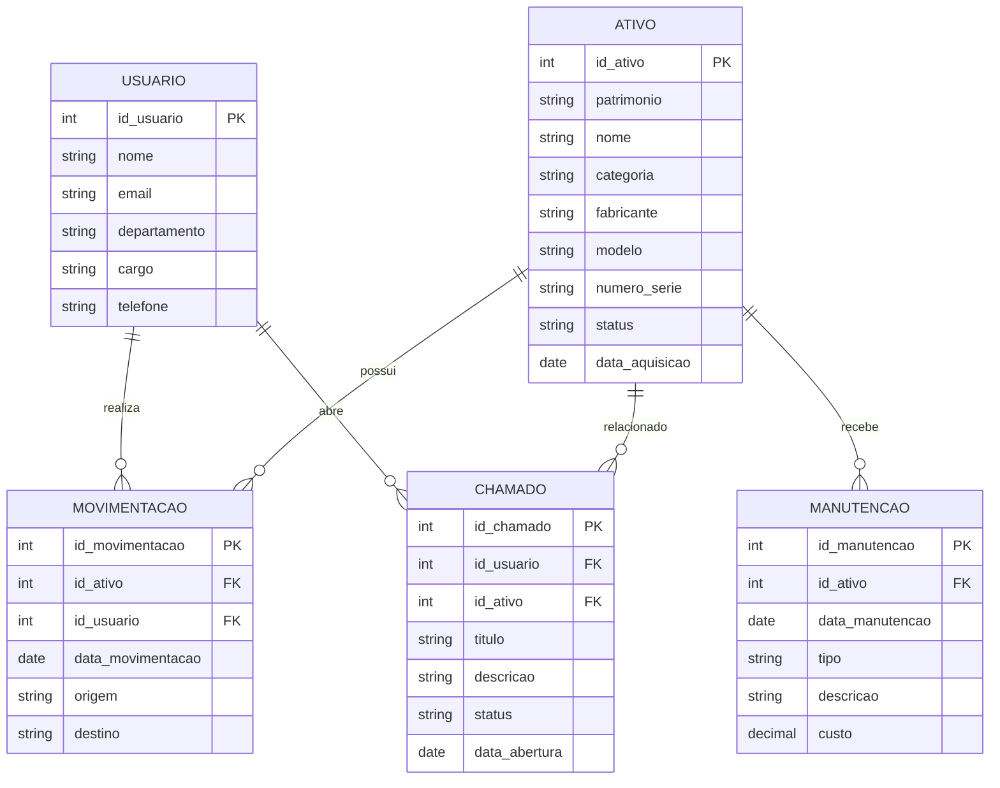

## 🗄️ Modelo Entidade-Relacionamento (ERD)

```mermaid
erDiagram

    USUARIO {
        int id_usuario PK
        string nome
        string email
        string departamento
        string cargo
        string telefone
    }

    ATIVO {
        int id_ativo PK
        string patrimonio
        string nome
        string categoria
        string fabricante
        string modelo
        string numero_serie
        string status
        date data_aquisicao
    }

    MANUTENCAO {
        int id_manutencao PK
        int id_ativo FK
        date data_manutencao
        string tipo
        string descricao
        decimal custo
    }

    MOVIMENTACAO {
        int id_movimentacao PK
        int id_ativo FK
        int id_usuario FK
        date data_movimentacao
        string origem
        string destino
    }

    CHAMADO {
        int id_chamado PK
        int id_usuario FK
        int id_ativo FK
        string titulo
        string descricao
        string status
        date data_abertura
    }

    USUARIO ||--o{ MOVIMENTACAO : realiza
    ATIVO ||--o{ MOVIMENTACAO : possui

    ATIVO ||--o{ MANUTENCAO : recebe

    USUARIO ||--o{ CHAMADO : abre
    ATIVO ||--o{ CHAMADO : relacionado
```
